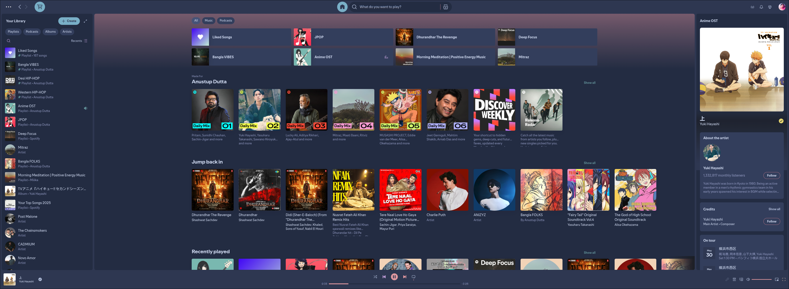
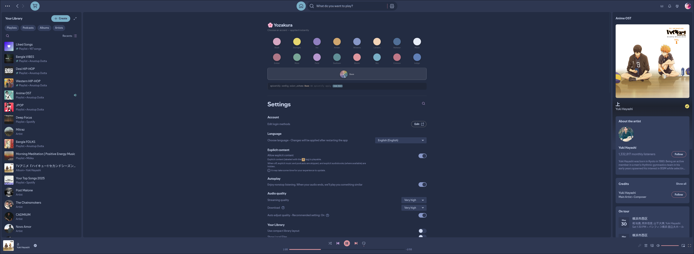
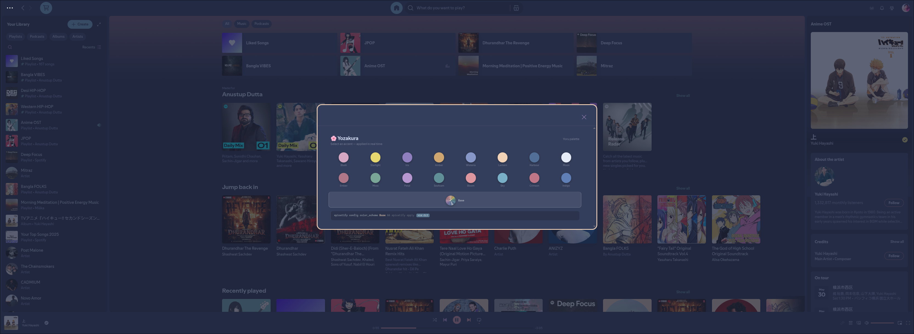

<div align="center">


# 夜桜 Yozakura — Spicetify Theme

A handcrafted pastel color palette for [Spicetify](https://spicetify.app), based on the [Yozakura](https://shunsui18.github.io/yozakura) palette.

[](LICENSE)
[](https://spicetify.app)
[](install.sh)
[](https://github.com/shunsui18/yozakura)

</div>

---

## ✦ Flavors

| | Flavor | Description |
|---|---|---|
| 🌸 | **Yoru** *(night)* | Deep, moonlit background with soft sakura accents — default |
| ☀️ | **Hiru** *(day)* | Warm ivory canvas with gentle pastel tones |

<br>

<table>
<tr>
<td align="center"><b>🌸 Yoru</b></td>
<td align="center"><b>☀️ Hiru</b></td>
</tr>
<tr>
<td></td>
<td></td>
</tr>
</table>

---

## ✦ Accents

Each flavor ships with **17 accent schemes**. The special `Base` accent activates multi-accent mode — all 16 named accents are applied simultaneously across distinct UI zones by the switcher extension at runtime.

| Accent | | Accent | | Accent |
|---|---|---|---|---|
| 🌟 **Base** *(multi-accent)* | | 🌊 **Harbour** | | ✨ **Starlight** |
| 🏮 **Lantern** | | 🩵 **Sky** | | 🍂 **Amber** |
| 🌸 **Blush** | | 🌿 **Seafoam** | | 🔥 **Ember** |
| 🌷 **Petal** | | 🪴 **Moss** | | ❤️ **Crimson** |
| 🔮 **Iris** | | | | 🌺 **Bloom** |
| 💜 **Wisteria** | | | | 🌙 **Moon** |
| 🫐 **Indigo** | | | | |

<br>

<table>
<tr>
<td align="center"><b>🌟 Base (multi-accent) — Yoru</b></td>
<td align="center"><b>🌟 Base (multi-accent) — Hiru</b></td>
</tr>
<tr>
<td></td>
<td></td>
</tr>
<tr>
<td align="center"><b>Accent switcher — settings — Yoru</b></td>
<td align="center"><b>Accent switcher — settings — Hiru</b></td>
</tr>
<tr>
<td></td>
<td></td>
</tr>
<tr>
<td align="center"><b>Accent switcher — modal — Yoru</b></td>
<td align="center"><b>Accent switcher — modal — Hiru</b></td>
</tr>
<tr>
<td></td>
<td></td>
</tr>
</table>

---

## ✦ Installation

### Interactive — One-liner

Run without any arguments to launch the guided menu:

```bash
bash <(curl -fsSL https://raw.githubusercontent.com/shunsui18/yozakura-spicetify/main/install.sh)
```

The installer will walk you through picking a flavor and accent:

```
  ╭──────────────────────────────────────────────╮
  │        夜桜  Yozakura — Spicetify             │
  │     github.com/shunsui18/yozakura-spicetify  │
  ╰──────────────────────────────────────────────╯

  ╭─ Choose a flavour ──────────────────────────╮
  │   1)  Yoru (夜 · night · dark)              │
  │   2)  Hiru (昼 · day  · light)              │
  ╰─────────────────────────────────────────────╯

  ❀  Flavour [1/2]: _

  ╭─ Choose an accent ──────────────────────────╮
  │    1)  Base            2)  Lantern          │
  │    3)  Blush           4)  Petal            │
  │    5)  Iris            6)  Wisteria         │
  │    7)  Indigo          8)  Harbour          │
  │    9)  Sky            10)  Seafoam          │
  │   11)  Moss           12)  Starlight        │
  │   13)  Amber          14)  Ember            │
  │   15)  Crimson        16)  Bloom            │
  │   17)  Moon                                 │
  ╰─────────────────────────────────────────────╯

  ❀  Accent [1-17]: _
```

---

### Non-interactive — Flags

Skip the menu entirely by passing flags directly:

```bash
bash <(curl -fsSL https://raw.githubusercontent.com/shunsui18/yozakura-spicetify/main/install.sh) --theme yoru --accent Bloom
```

| Flag | Values | Description |
|---|---|---|
| `--theme` | `yoru` \| `hiru` | Theme flavor to install |
| `--accent` | Any accent name (case-insensitive) | Color scheme to activate |
| `-h`, `--help` | — | Show help |

Accent names are matched case-insensitively — `bloom`, `Bloom`, and `BLOOM` all work.

---

### Manual Installation

If you prefer to clone and run locally:

```bash
# 1. Clone the repo
git clone https://github.com/shunsui18/yozakura-spicetify.git && cd yozakura-spicetify

# 2a. Interactive
./install.sh

# 2b. Or with flags
./install.sh --theme hiru --accent Iris
```

---

### Switching Accents After Install

The switcher extension adds an accent panel to Spotify's preferences page — no terminal needed. To switch from the command line instead:

```bash
spicetify config color_scheme Crimson && spicetify apply
```

---

## ✦ What the Installer Does

1. **Menu or flags** — launches an interactive prompt if no arguments are given, or skips straight to install when flags are provided
2. **Self-locates** — resolves its own path regardless of whether it is invoked locally or piped from `curl`; remote runs fetch assets directly from GitHub
3. **Cleans up** — detects and deregisters any previously installed Yozakura extension (either flavor) before applying the new one, preventing duplicate entries
4. **Copies** theme files into `$HOME/.config/spicetify/Themes/yozakura-{flavor}/` and the switcher extension into `$HOME/.config/spicetify/Extensions/`, creating directories as needed
5. **Configures** spicetify — sets `current_theme`, `color_scheme`, and `extensions` via `spicetify config`
6. **Applies** — runs `spicetify apply` to patch Spotify immediately

---

## ✦ File Structure

```
yozakura-spicetify/
├── assests/
│   ├── yozakura-yoru-base-spicetify-preview.png
│   ├── yozakura-yoru-spicetify-extension-preview-1.png
│   ├── yozakura-yoru-spicetify-extension-preview-2.png
│   ├── yozakura-hiru-base-spicetify-preview.png
│   ├── yozakura-hiru-spicetify-extension-preview-1.png
│   └── yozakura-hiru-spicetify-extension-preview-2.png
├── Extensions/
│   ├── yozakura-yoru-switcher.js
│   └── yozakura-hiru-switcher.js
├── Themes/
│   ├── yozakura-yoru/
│   │   ├── color.ini
│   │   └── user.css
│   └── yozakura-hiru/
│       ├── color.ini
│       └── user.css
├── install.sh
├── LICENSE
└── README.md
```

---

<div align="center">

crafted with 🌸 by [shunsui18](https://github.com/shunsui18)

</div>
